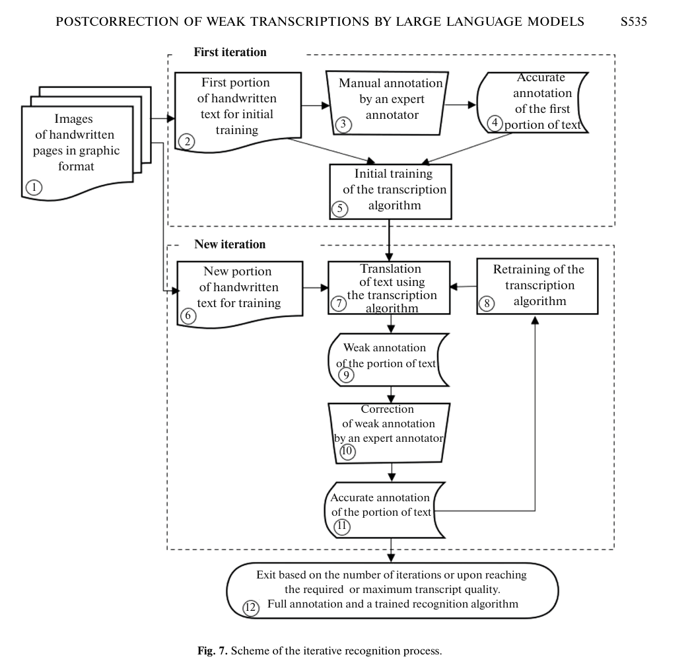

# Historical Handwriting Transcription System

## General Goal: 
A historical handwriting transcription pipeline and platform that allows few shot sampling, permits testing and evaluating different models, certainty heat mapping of text and a transcription editing interface that feeds back into the few shot sampling, and potentially allows for finetuning of local models on a growing corpus of data.

## Stakes: 
Historians are deeply interested in transcribing a variety of documents into machine-readable text, which facilitates data-driven practices such as distant reading, network analysis, topic modelling and thematic analysis, and the like. Handwritten Text Recognition (HTR) is technically challenging, but handwritten documents contain crucial data for many subfields and periods. Making handwritten historical documents machine-readable also plays a key role in producing history 'from the ground up' by facilitating the inclusion of underesourced voices.

Lucien Li writes "The vast majority of historical documents exist only in manuscript form. Correspondence, personal notes, ledgers, and other unpublished documents provide an enormous source of data that is completely inaccessible to computational text analysis methods. Even for traditional humanists, the lack of keyword search and indexing makes the research process significantly less efficient. Research in these areas requires painstaking and difficult close reading, or the mobilization of huge numbers of volunteer transcribers as in [1]. These barriers prove prohibitive in most cases and limit the scope and scale of potential questions."

## Challenges
Kim et. al. 2025: "Historical records are more challenging to transcribe than modern documents due to cursive handwriting styles, the degraded quality of the texts (e.g., faded inks or damaged paper), language changes, and document layouts."

Semnani et. al. describe a variety of challenges: "document degradation caused by environmental factors over time further complicates text extraction (Sulaiman et al., 2019). Historical documents frequently contain features such as marginalia (Cheng et al., 2024), rubrication (Whetter, 2017), and illumination (Wyatt and Tymms, 1861), which are rarely encountered in modern texts. In addition, the wide variety of fonts used in printed documents and the lack of consistent orthographic standards (e.g., multiple spellings of the same word within a single document) pose further challenges (Drobac et al., 2017).

Handwritten text recognition (HTR) (AlKendi et al., 2024) is even more challenging due to the vast diversity of handwriting styles and calligraphic traditions (Blair, 2020), even within the same language. Historical scribes frequently abbreviated words to expedite writing, resulting in thousands of unique abbreviations (Candido and Aluísio, 2009), especially in pre-modern documents (Guéville and Wrisley, 2022; Rogos-Hebda, 2025)."

## Known Existing Products:
* Transkribus (https://www.transkribus.org/): model choice, drop images, output transcriptions
* Tesseract (https://github.com/tesseract-ocr/tesseract): open source OCR
* eScriptorium (https://escriptorium.rich.ru.nl/): open source, both automatic and manual transcription, model training
* Transcription Pearl (https://github.com/mhumphries2323/Transcription_Pearl): 
* HTRflow (https://ai-riksarkivet.github.io/htrflow/latest/)
* Others: Ocelus/Teklia (https://www.teklia.com/en), Konfuzio (https://konfuzio.com/en/document-ocr/), DOCSUMO (https://www.docsumo.com/resources/pdf-to-text-converter)

## Key Metrics

### CER, WER, BLEU, and Human Evaluation
Character Error Rate and Word Error Rate are calculated based on how many edits would be necessary to correct the transcription text. Current state of the art CER and WER rates: [insert table]
BLEU is a more sophisticated calculation that focuses on the precision of recalling individual words and sequences of words, and it correlates a bit better to human judgment.
Kim et. al. also use human evaluations of the outputs, scored on a scale of 0 - 5 for overall quality of transcriptions.

### Speed

### Cost
Price per image transcribed. Current comparable costs for different models: 

### English vs. Other Languages
Most LLM training data is written in English. As a result, HTR on English language documents has low overall error rates than HTR on some other languages. Many languages with a relatively small number of native speakers, or from non-Western nations are not well-served by available contemporary LLMs.

Li noticed significantly worse CER using Gemini on non-English texts: "Biases in representation of non English languages in the Gemini training dataset makes it much weaker for non-English languages. For these applications, it is still necessary to use trained neural models."

Crosilla noted that "LLMs perform well in transcribing English handwritten text and modern handwriting, though their accuracy declines progressively in other languages."

## State of the Field:
What follows are brief summaries of key findings on pertinent topics in the field.

### LLMs vs. OCR
Is the field mixed on whether one approach is superior to the other? Note Greif et. al.'s literature review: "Li [48] found that for handwritten texts in French, Italian, Spanish, and Dutch published between the sixteenth and nineteenth centuries, fine-tuned TrOCR and CNN-BiLSTM models drastically outperform an unspecified Gemini model. Kim et al. [49] found that for (mostly) handwritten probation records from 1921 Belgium, Claude (prompted with two few-shot examples) produced a more accurate transcription than other OCR engines (EasyOCR, TrOCR, KerasOCR, Tesseract) and outperformed fine-tuned TrOCR versions. Humphries et al. [50] found that for their corpus of eighteenth and nineteenth century English handwriting, Gemini-1.5-pro, GPT-4o, and Claude-Sonnet-3.5 all achieved transcription accuracies comparable to and sometimes better than conventional state-of-the-art OCR algorithms. Ghiriti et al. [51] tested the transcription capabilities of GPT-4 Vision-Preview and its response to various artificially introduced distortions and degradations for a corpus of early twentieth century German-language Fraktur prints and found that it outperformed Tesseract, except for those documents with complex layouts."

Several current papers suggest methods for LLMs to correct OCR transcriptions (Greif et. al. 2025).

Crosilla et. al. note that "for the recognition of the English historical dataset, the results are balanced. While The Text Titan achieves the best outcome with 7,07% CER and 12,41% WER, LLMs are not far behind. ... Moreover, the discrepancy between the models’ performance dealing with English historical and modern texts exhibits a language bias which mirrors the intrinsic one in LLMs caused by most of its training data being in English. Therefore, these models result in being biased not only from a linguistic aspect but also in relation to the characteristics of handwriting (Hodel, 2022, p.169). The accuracy decline is even more pronounced for non-English datasets, where neither Transkribus models nor LLMs consistently outperform one another."

They conclude: "Platforms like Transkribus and general LLMs will likely continue to coexist as tools supporting users’ activities, each being selected based on specific needs. LLMs are quicker, less expensive in terms of material preparation and adaptation, and allow for iterative task adjustments through interaction with the API. However, they still require improvement in the recognition of historical handwritten documents in different languages. On the other hand, Transkribus offers a wide variety of tools, and the shift from highly specialized models to supermodels will likely lead to uniform improved performance on languages other than English. At the moment, for tasks requiring highly tailored solutions, Transkribus’ user interface and specialized models remain advantageous."

Semnani et. al. study Azure's OCR solution, which employs bounding boxes, as well as a hybrid solution which uses a VLM and Azure OCR to help overcome challenges "VLMs face with long inputs."

Levchenko finds from an evaluation of "12 multimodal LLMs ... that Gemini and Qwen models outperform traditional OCR while exhibiting "over-historicization"—inserting archaic characters from incorrect historical periods. Post-OCR correction degrades rather than improves performance."

### Local, finetuned models vs. general models
Greif et. al.: "Although TrOCR models with corpus-specific fine-tuning have been shown to yield very accurate results for handwritten texts [20], the limited existing evidence suggests that for Latin script prints, Transkribus’ Text Titan I outperforms a corpus-fine-tuned TrOCR model [72]."

CHURRO (Semnani et al 2025) is a 3B parameter model 'specialized for historical text recognition.' 

Meoded claims that "results demonstrate the effectiveness of domain-specific augmentations and ensemble strategies for advancing historical handwritten text recognition."

### Zero shot, few shot learning
Kim et. al. 2025: "two-shot GPT-4o for line-by-line images and two-shot Claude Sonnet 3.5 for whole-scan images yield the transcriptions of the historical records most similar to the ground truth."

### Processing Modes
Line-based, full page-based, and 'sliding window' based.
Levchenko describes the full page-based processing as 'the best model for most models'. 
### Key Prompt Enginnering Techniques

#### Role Prompting and Context Setting
Simple prompts, context-enhanced prompts, and context-enhanced prompts in the language of the document (Levchenko).

#### Temperature setting
Most researchers report settings the temperature to 0.0 to prevent the bastardization of text in transcription.

#### Anti-hallucination Safeguards
Anti-error prompts.

#### Paleographic and Linguistic Contexts
Levchenko finds 'LLMs consistently "over-historicize" 18th century Russian texts," as well as lacking the ability to insert some period characters as well as difficulty with diacritical marks.

#### Disorganized writing

#### Image and manuscript issues
##### DPI
##### Damaged documents
##### Rotation, folding

### Challenges of Historical Handwritten Documents

### Post-Correction, Multi-pass, Self-verification, Multiple model verification, 'Council' approaches
From Crosilla: "Post-OCR or HTR correction can be approached in different ways, from crowdsourcing to the automatic post-correction of previous predictions using LLMs (Bourne, 2025, p.2)."

According to Zykov and Mestetskiy, "LLM postcorrection (exemplified by the ChatGPT-4o service) substantially improves the readability of weak transcriptions and significantly reduces the word error rate (in our experiments, by about –12 percentage points), without degrading the character error rate. Another service tested, DeepSeek-R1, has demonstrated less stable behavior. Practical prompt engineering and limitations (context length limits, risk of “hallucinations”) are discussed, and recommendations are provided for the safe integration of LLM postcorrection into an iterative annotation pipeline to reduce expert annotators’ workload and speed up the digitization of historical archives."

### Named Entity Recognition

## Proposed Stack
1. Dedicated GPU workstation for local models
2. ACCESS resources to finetune local models?
3. API calls to frontier models
4. Any scanning resources? (Titan scanner, e.g.)
5. HTR datasets (https://htr-united.github.io/, Alkendi et al. section 3, table 6)
6. Models (huggingface.co, https://zenodo.org/communities/ocr_models/records?q=&l=list&p=1&s=10&sort=newest, HTRflow, OpenAI, Anthropic, Google Gemini)

## Proposed Algorithmic and Pipeline Components:

1.	Model Chooser (local or cloud): LLM and OCR system?
2.	Accuracy scores per run evaluator
3.	Prompt builder/chooser
    1.	Second pass verification prompts?
    2. Using a different model?
4.	‘Few shot’ learning chooser
5.	Model training techniques:
    1. Document layout and line identification function (with second pass and human correction?)
    2. Image normalization
    3. Word segmentation, character recognition
    4. Layer Normalization, Beam Search, Focal Loss 
6.	Certainty heat mapping
7.	Editing output to gold standard
8.	Use of gold standard examples in few shot learning
9.	Finetuning on a growing corpus
10.	Batch handling features

## Bibliography

See [bibliography.md](bibliography.md) for the full bibliography.

## Appendices: 

### Prompt Examples

from Crosilla et. al.:
“You are an AI assistant specialized in transcribing handwritten text from images. Please follow these guidelines: 1. Examine the image carefully and identify all handwritten text. 2. Transcribe ONLY the handwritten text. Ignore any printed or machine-generated text in the image. 3. Maintain the original structure of the handwritten text, including line breaks and paragraphs. 4. Do not attempt to correct spelling or grammar in the handwritten text. Transcribe it exactly as written. 5. Do not describe the image or its contents. 6. Do not introduce or contextualize the transcription. Remember, your goal is to provide an accurate transcription of ONLY the handwritten portions of the text, preserving its original form as much as possible.” 

from Zykov and Mestetskiy:
"Your task is to correct the input text, correcting errors in it. This is text recognized by a computer vision model from manuscripts. The manuscripts are written in 19th-century Russian (other languages are also sometimes present). The goal is to obtain a transcript that is as close as possible to the manuscript. The model makes errors in character recognition. Correct only the most obvious and understandable places. If a piece of text is difficult to understand, then save it in the same form in which you received it. Keep proper names and numerals as they are. Keep the original sequence of words. You will be presented with lines recognized by the computer vision model, with “→” symbols added at the end. You need to return the corrected line. Examples: 1856. Мартъ → 1856. Мартъ 3-е. Въ часовъ пріѣхалъ въ Канугу. Дядѣ принялъ меня → 3е. Въ 11 часовъ пріѣхалъ въ Калугу. Дядя принялъ меня лучше. Стотрѣли иланхъ моего завода – онъ далъ мнѣ → лучше. Смотрѣли планы моего Завода – онъ далъ мнѣ Отдалъ перепиывать піэссу въ Печать. → Отдалъ переписывать піэссу въ печать. < Other examples …>"

### Process Examples

